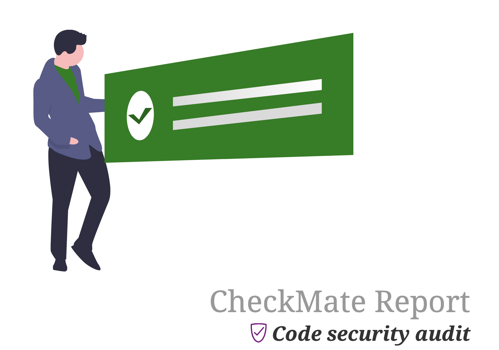

<p align="center">
  
</p>

# CheckMate: Hard-coded Secrets Detection

[](https://goreportcard.com/report/github.com/adedayo/checkmate)

[](https://github.com/adedayo/checkmate/blob/master/LICENSE)



---

## Why CheckMate? A Security Leader's Perspective

Hard-coded secrets (API keys, passwords, tokens, and certificates embedded in source code) are one of the most persistent and underestimated risks in software development. A single leaked credential can be the difference between a routine day and a breach that makes the news.

**Why this deserves a place in your security strategy:**

- **The exploitation window is minutes, not days.** Automated scanners continuously sweep public repositories for credentials. Research shows secrets pushed to GitHub are typically found within minutes. The question is not whether a leaked secret gets discovered; it is whether an attacker finds it before you do.
- **You cannot fix what you cannot see.** Most engineering organisations genuinely do not know how many hard-coded secrets exist across their codebases, CI/CD configurations, Dockerfiles, and log outputs. Without systematic detection, you are managing a risk you cannot quantify.
- **Secrets sprawl far beyond source code.** API keys and passwords turn up in configuration files, pipeline logs, `.env` files, application startup output, and test fixtures, across every repository and every team. A single audit is a snapshot; CheckMate provides continuous visibility.
- **Compliance frameworks require demonstrable controls.** PCI-DSS, SOC 2, ISO 27001, and GDPR require active, evidenced controls over credential management. Exception justifications, scan history, and immutable audit trails are the kind of artefacts that pass an audit, not policies alone.
- **False positives destroy adoption.** Security tooling that cries wolf gets disabled. CheckMate's AI triage layer reduces analyst noise, ensuring the findings that surface are worth acting on.

---

## What CheckMate Does

CheckMate uses a multi-layered detection engine combining **entropy analysis**, **structural context**, and **pattern recognition** to find hard-coded secrets in:

- Source code (Java, C/C++, C#, Ruby, Scala, Go, and more)
- Configuration files (YAML, XML, `.env`, properties files)
- Log files and application output
- Sensitive file types (certificates, key stores, private keys)
- Git repositories, including remote repositories scanned directly by URL

Detection results include:
- The exact location (file, line, column) of the finding
- Checksums of the detected secret value for safe deduplication and tracking
- A severity rating and secret type classification
- Source code context as evidence

---

## Key Platform Capabilities

### 🔐 Bring-Your-Own-Key (BYOK) AI Triage

Alert fatigue is the enemy of effective security. CheckMate integrates with **any OpenAI-compatible endpoint** (including local, air-gapped models via [Ollama](https://ollama.com/)) to automatically assess whether a finding is a genuine secret or a false positive. Each AI-triaged finding gets a `fpLikelihood` score, a plain-language summary, remediation hints, and a full token usage audit trail. Critically, **your code never leaves your infrastructure**: you control the AI, and you hold the keys.

### 🛡️ Auditable Exception Management

Not every flagged value is actionable immediately. CheckMate exceptions are **first-class governed entities**, not a simple ignore list. Each exception requires:

- A mandatory justification and reason
- A defined scope (global, project, directory, file, exact line, or secret checksum)
- An optional expiry date (exceptions auto-expire; risk doesn't just disappear)
- A full, immutable audit trail of who created, modified, or revoked the exception

This gives security and compliance teams a defensible, auditable record of every suppression decision.

### 📡 Real-Time Webhook Notifications

CheckMate can push `scan.completed` and `finding.detected` events to any external HTTP endpoint: Slack, Jira, PagerDuty, SIEM platforms, or custom CI/CD pipelines. Payloads are HMAC-signed for authenticity verification. Security operations don't have to poll; they get notified.

### 📊 SARIF 2.1.0 Output for SIEM & Code Scanning Integration

Scan results can be exported in [SARIF 2.1.0](https://sarifweb.azurewebsites.net/) format, including `partialFingerprints`, enabling seamless ingestion into **GitHub Code Scanning**, enterprise SIEM dashboards, and vulnerability management platforms, with no middleware required.

### 🔄 Automated Scheduled Scanning

The CheckMate API server includes a built-in scheduler for **continuous, automated repository monitoring**. Security posture is not a point-in-time measurement; CheckMate keeps watching so you don't have to manually trigger audits.

### 🏗️ Flexible Deployment

| Mode | Description |
|---|---|
| **CLI** | Developer workstation, scripting, one-shot audits |
| **Docker** | Container-native scanning in any environment |
| **API Server** | Self-hosted platform with REST API, JWT auth, and SQLite persistence |
| **GitHub Action** | Native CI/CD integration; block secrets before they merge |
| **Desktop App** | GUI application for non-CLI users |
| **LSP Server** | IDE integration (Language Server Protocol) for in-editor warnings |

---

## Installation

### macOS (via Homebrew)
```bash
brew install adedayo/tap/checkmate
```


### Pre-built Binaries
Download the latest pre-built binaries for your operating system from the [releases page](https://github.com/adedayo/checkmate/releases).

### Docker
```bash
docker pull ghcr.io/adedayo/checkmate
```

### Desktop Application
A graphical desktop version of CheckMate is available: [CheckMate Desktop Application](https://github.com/adedayo/checkmate-app/releases).

---

## Usage

### CLI: Scan Files, Directories, or Git Repositories

```bash
# Scan a local directory
checkmate search /path/to/your/project

# Scan a remote git repository directly
checkmate search https://github.com/example/repository.git

# Scan with SARIF output for GitHub Code Scanning
checkmate search --sarif /path/to/project > results.sarif

# Generate a PDF audit report
checkmate search --pdf /path/to/project
```

#### Key CLI Flags

| Flag | Description |
|---|---|
| `--calculate-checksums` | Compute checksums of detected secrets (default: true) |
| `--exclude-tests` | Skip test files during scanning |
| `-e, --exclusion <file>` | Use an exclusion YAML configuration file |
| `--json` | Generate output in JSON format (default: true) |
| `--pdf` | Generate a native PDF audit report |
| `--report-ignored` | Include ignored files and values in reports |
| `--running-commentary` | Stream results as they are found (useful for large repos) |
| `--sample-exclusion` | Generate a sample exclusion YAML file |
| `--sarif` | Generate SARIF 2.1.0 output |
| `--sensitive-files` | List all registered sensitive file types |
| `--sensitive-files-only` | Scan only for sensitive files (certificates, key stores) |
| `-s, --source` | Include source code evidence in results (default: true) |
| `--verbose` | Enable verbose output |

### API Server

Run CheckMate as a persistent, self-hosted API service:

```bash
checkmate api --port 17283 --data-path ~/.checkmate
```

The API server provides:
- JWT-authenticated REST endpoints for projects, scans, findings, exceptions, and webhooks
- Real-time scan event streaming via Server-Sent Events (SSE)
- Automated scheduled scanning of monitored repositories

For full API capabilities including BYOK AI Triage, Webhook Notifications, and Auditable Exceptions, see the [Features & Capabilities Documentation](docs/features.md).

### Docker

```bash
# Scan a local directory
docker run --rm -v $(pwd):/data ghcr.io/adedayo/checkmate search /data

# Scan a remote git repository
docker run --rm ghcr.io/adedayo/checkmate search https://github.com/example/repository.git
```

### GitHub Actions

Add CheckMate to your CI/CD pipeline to catch secrets before they merge:

```yaml
- name: CheckMate Secret Scan
  uses: adedayo/checkmate@latest
```

### Generating PDF Reports

CheckMate generates executive-ready PDF audit reports natively:

```bash
checkmate search <path> --pdf
```

PDF report generation is **100% native** and runs directly out of the box with zero external dependencies.


---

## Compliance & Governance Use Cases

CheckMate is designed to support the following security and compliance scenarios:

| Use Case | How CheckMate Helps |
|---|---|
| **Pre-commit / PR scanning** | Block secrets from entering the codebase at the source via GitHub Action |
| **Repository-wide audit** | Establish a baseline of existing exposure across all repositories |
| **Continuous monitoring** | Automated, scheduled scans catch regressions as codebases evolve |
| **Audit evidence** | Exception justifications, immutable audit trails, and PDF reports provide auditor-ready documentation |
| **SIEM integration** | SARIF output and webhooks feed findings into enterprise monitoring infrastructure |
| **Air-gapped AI triage** | Reduce analyst workload without sending sensitive code to third-party cloud services |
| **PCI-DSS / SOC 2 / ISO 27001** | Demonstrate active, continuous controls over credential management |

---

## Project Architecture

CheckMate is structured as a layered platform:

```
checkmate/
├── cmd/                  # CLI commands (search, api, lsp-serve)
├── pkg/
│   ├── ai/               # BYOK AI triage client (OpenAI-compatible)
│   ├── api/              # REST API handlers and routing
│   ├── auth/             # JWT authentication
│   ├── cron/             # Scheduled scan automation
│   ├── lsp/              # Language Server Protocol support
│   ├── report/           # SARIF report generation
│   ├── reports/pdf/      # Native PDF report generation
│   ├── sdk/              # Shared types (Finding, AIAnnotation, etc.)
│   └── store/sqlite/     # SQLite-backed persistence with versioned migrations
```

The scanner engine itself lives in [`checkmate-plugin/secrets-finder`](https://github.com/adedayo/checkmate-plugin), a separate, reusable module, allowing CheckMate to be embedded or extended independently of the platform.

---

## Contributing

Contributions are welcome. Please open an issue or pull request on [GitHub](https://github.com/adedayo/checkmate).

## License

BSD 3-Clause License. See [LICENSE](LICENSE) for details.

**Author:** Dr. Adedayo Adetoye (Dayo): [https://github.com/adedayo](https://github.com/adedayo)
