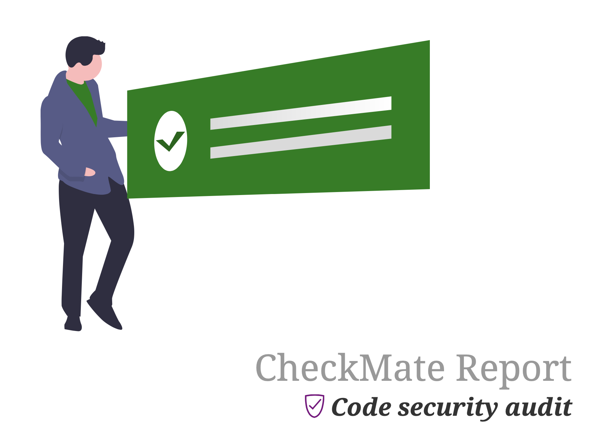

# CheckMate: Hard-Coded Secrets Detection

[](https://goreportcard.com/report/github.com/adedayo/checkmate)

[](https://github.com/adedayo/checkmate/blob/master/LICENSE)



## Overview

Exposed secrets in source code, logs, or configuration files can lead to security breaches. Attackers scan repositories for credentials that grant unauthorized access to critical systems. Even a single leaked API key or password can cause data breaches, service disruptions, and compliance violations. Detecting and removing these risks early is essential for security. 

_CheckMate_ is an advanced tool for detecting hard-coded secrets in source code, logs, and configuration files. It employs heuristics such as entropy analysis, structural context, and pattern recognition to identify sensitive information, including:

- Passwords
- API keys
- Encryption keys
- Other security tokens

Supported file types include configuration formats like YAML and XML, as well as source code in languages such as Java, C/C++, C#, Ruby, Scala, and more.

## Installation

### Pre-built Binaries
Download the latest pre-built binaries for your operating system from the [releases page](https://github.com/adedayo/checkmate/releases).

### macOS Installation (via Homebrew)
```bash
brew tap adedayo/tap
brew install checkmate
```

### Desktop Application
A graphical desktop version of CheckMate is available: [CheckMate Desktop Application](https://github.com/adedayo/checkmate-app/releases).

## Usage

### Command-Line Interface (CLI)
To scan files and directories for secrets, run:
```bash
checkmate search <paths to directories and files to scan>
```

### CLI Help
View available options with:
```bash
checkmate search --help
```

#### Key Command-Line Flags
| Flag                     | Description                                                        |
| ------------------------ | ------------------------------------------------------------------ |
| `--calculate-checksums`  | Compute checksums of detected secrets (default: true)              |
| `--exclude-tests`        | Skip test files during scanning                                    |
| `-e, --exclusion <file>` | Use an exclusion YAML configuration file                           |
| `--json`                 | Generate output in JSON format (default: true)                     |
| `--pdf`                  | Generate a PDF report (requires asciidoctor-pdf)                   |
| `--report-ignored`       | Include ignored files and values in reports                        |
| `--sensitive-files-only` | Only search for sensitive files (e.g., certificates, key stores)   |
| `-s, --source`           | Include source code evidence in diagnostic results (default: true) |
| `--verbose`              | Enable verbose output (e.g., current file being scanned)           |

## Running CheckMate with Docker
CheckMate can also be run as a Docker container:

### Pull the Docker Image
```bash
docker pull ghcr.io/adedayo/checkmate
```

### Scan a Local Directory
```bash
docker run --rm -v $(pwd):/data adedayo/checkmate search /data
```

### Scan a Git Repository
```bash
docker run --rm adedayo/checkmate search https://github.com/example/repository.git
```

## Generating Reports
CheckMate can produce a detailed PDF report. To enable this feature, install [Asciidoctor PDF](https://asciidoctor.org/docs/asciidoctor-pdf/) and ensure it's in your `$PATH`.

Run CheckMate with the `--pdf` flag:
```bash
checkmate search <path> --pdf
```

A sample report is available here: [bad-code-audit.pdf](bad-code-audit.pdf)


